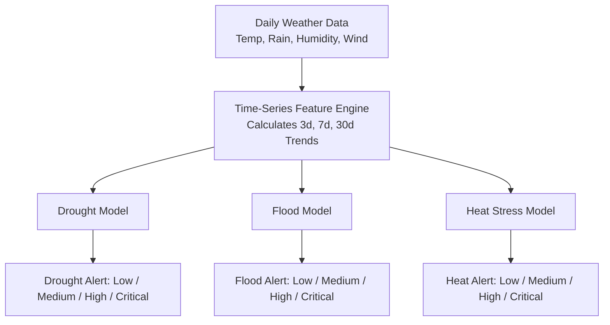

# AgriSmart AI - Climate & Weather Risk ML Pipeline

---

## 🌟 Quick Overview: How the Model Works (Simple Explanation)

Farmers face three major climate threats that can destroy crops:
1. **Drought Risk** (Prolonged dry spells & low soil moisture)
2. **Flood Risk** (Sudden heavy downpours & waterlogging)
3. **Heat Stress Risk** (Excessive temperatures burning crops & livestock)

Instead of only looking at today's single temperature or rainfall reading, the AI analyzes **weather patterns over time (3, 7, 14, and 30-day trends)** to classify risk into four actionable levels: **Low**, **Medium**, **High**, or **Critical**.



### Inside the 3 Models

#### 🌾 1. Drought Risk Model
- **Core Question**: *"Has the soil been starving of water for weeks while being dried out by heat?"*
- **Factors Checked**: 30-day & 14-day cumulative rainfall, 7-day average humidity, 7-day average temperature.
- **Example**: 30-day rainfall $< 3\text{ mm}$, humidity $< 35\%$, and average temp $> 28^\circ\text{C}$ $\rightarrow$ **Critical Drought Risk**.

#### 🌊 2. Flood Risk Model
- **Core Question**: *"Is rain falling faster than the soil and drainage channels can absorb?"*
- **Factors Checked**: Daily rainfall burst, 3-day rainfall, and 7-day cumulative rainfall (soil saturation).
- **Example**: Today's rain $\ge 100\text{ mm}$ OR 3-day rain $\ge 180\text{ mm}$ $\rightarrow$ **Critical Flood Risk**.

#### ☀️ 3. Heat Stress Model
- **Core Question**: *"Are crops suffering under prolonged extreme heat with no overnight cooling?"*
- **Factors Checked**: Maximum daytime temperature ($T_{\text{max}}$), consecutive hot days streak ($T_{\text{max}} \ge 38^\circ\text{C}$), and night temperature ($T_{\text{min}}$).
- **Example**: $T_{\text{max}} \ge 44^\circ\text{C}$ OR 3+ days in a row $> 42^\circ\text{C}$ $\rightarrow$ **Critical Heat Stress**.

### ML Algorithm: Random Forest Classifier
- An ensemble of **100 Decision Trees**.
- Trees evaluate different combinations of weather indicators in parallel and vote together, delivering robust, stable, and unbiased risk predictions.

---

## 1. Dataset Source & Overview
- **Source**: NASA POWER (Prediction Of Worldwide Energy Resources) Daily Meteorological API.
- **Coverage**: 98 agricultural districts across Maharashtra, Gujarat, Madhya Pradesh, Karnataka, Rajasthan, and Uttar Pradesh.
- **Temporal Range**: 2005-01-01 to 2025-12-31 (21 full years, 7,670 consecutive daily records per district).
- **Total Records**: 751,660 rows.
- **Raw Variables**:
  - `date`: Daily observation timestamp (`YYYY-MM-DD`).
  - `district`: Administrative district name.
  - `latitude`, `longitude`: Geospatial coordinates.
  - `T2M`: Daily mean temperature at 2m elevation (°C).
  - `T2M_MAX`: Maximum daily temperature at 2m elevation (°C).
  - `T2M_MIN`: Minimum daily temperature at 2m elevation (°C).
  - `RH2M`: Relative humidity at 2m elevation (%).
  - `PRECTOTCORR`: Corrected total daily precipitation (mm/day).
  - `WS10M`: Wind speed at 10m elevation (m/s).
  - `PS`: Surface atmospheric pressure (kPa).

---

## 2. Preprocessing & Data Cleaning
The data cleaner (`preprocessing/cleaner.py`) performs the following:
1. **Datetime Parsing**: Standardizes ISO date formatting and validates chronological monotonicity per district.
2. **Deduplication**: Audits and purges redundant row entries or duplicate `(district, date)` tuples.
3. **NASA Sentinel Value Auditing**: Detects missing or invalid sentinel codes (`-999` or `< -900`). Values are imputed using chronological group-wise linear interpolation with backward/forward fills, ensuring valid observations are never dropped.
4. **Physical Bounds Validation**:
   - Relative humidity is bounded in `[0.0, 100.0]%`.
   - Precipitation and wind speed are bounded at $\ge 0.0$.
   - Enforces physical thermal consistency (`T2M_MAX` $\ge$ `T2M_MIN`).

---

## 3. Time-Series Feature Engineering (Zero Data Leakage)
Engineered features (`features/engineer.py`) are computed chronologically per district using past and current observations only ($t \le \text{date}$):

| Feature Name | Description | Window / Aggregation |
| :--- | :--- | :--- |
| `rainfall_3d` | 3-day cumulative rainfall | Rolling sum (3 days) |
| `rainfall_7d` | 7-day cumulative rainfall | Rolling sum (7 days) |
| `rainfall_14d` | 14-day cumulative rainfall | Rolling sum (14 days) |
| `rainfall_30d` | 30-day cumulative rainfall | Rolling sum (30 days) |
| `temp_avg_7d` | 7-day average temperature | Rolling mean (7 days) |
| `temp_max_7d` | 7-day maximum temperature | Rolling max (7 days) |
| `temp_avg_30d` | 30-day baseline temperature | Rolling mean (30 days) |
| `rh_avg_7d` | 7-day average humidity | Rolling mean (7 days) |
| `ws_avg_7d` | 7-day average wind speed | Rolling mean (7 days) |
| `consecutive_hot_days` | Streak of days with $T_{\text{max}} \ge 38^\circ\text{C}$ | Cumulative sequence count |
| `rainfall_dev_30d` | Daily rainfall deviation from 30-day mean | $P - (R_{30\text{d}} / 30)$ |
| `temp_dev_30d` | Temperature deviation from 30-day baseline | $T_{\text{mean}} - T_{\text{avg, 30d}}$ |
| `temp_range` | Diurnal temperature range | $T_{\text{max}} - T_{\text{min}}$ |

---

## 4. Academic Baseline Risk Labeling Methodology
> **Academic Prototype Disclaimer**: The risk labels are generated via rule-based agronomic and meteorological criteria based on Indian Meteorological Department (IMD) standards and agro-climatological heat/drought stress literature. These serve as a robust baseline and are decoupled in `config/thresholds.py` so they can be replaced with real observed disaster records in production.

All models classify into 4 tiers: **`Low` (0)**, **`Medium` (1)**, **`High` (2)**, **`Critical` (3)**.

### A. Drought Risk Rules
- **Critical**: 30-day rainfall $\le 3\text{ mm}$, 14-day rainfall $\le 1\text{ mm}$, 7-day average $\text{RH} \le 35\%$, and 7-day average temp $\ge 28^\circ\text{C}$ (or $R_{30\text{d}} \le 1\text{ mm}$ & $\text{RH} \le 30\%$).
- **High**: 30-day rainfall $\le 12\text{ mm}$, 14-day rainfall $\le 4\text{ mm}$, $\text{RH}_{7\text{d}} \le 45\%$, and $T_{7\text{d}} \ge 26^\circ\text{C}$.
- **Medium**: 30-day rainfall $\le 30\text{ mm}$, 14-day rainfall $\le 10\text{ mm}$, $\text{RH}_{7\text{d}} \le 55\%$.
- **Low**: Normal rainfall and sufficient soil moisture indicators.

### B. Flood Risk Rules
- **Critical**: Daily rainfall $\ge 100\text{ mm}$, 3-day rainfall $\ge 180\text{ mm}$, or 7-day rainfall $\ge 250\text{ mm}$.
- **High**: Daily rainfall $\ge 60\text{ mm}$, 3-day rainfall $\ge 100\text{ mm}$, or 7-day rainfall $\ge 150\text{ mm}$.
- **Medium**: Daily rainfall $\ge 25\text{ mm}$, 3-day rainfall $\ge 45\text{ mm}$, or 7-day rainfall $\ge 75\text{ mm}$.
- **Low**: Rainfall below flood and water-logging threshold levels.

### C. Heat Stress Rules
- **Critical**: $T_{\text{max}} \ge 44^\circ\text{C}$, or ($T_{\text{max}} \ge 42^\circ\text{C}$ with $\ge 3$ consecutive hot days), or ($T_{\text{max}} \ge 40^\circ\text{C}$, $\ge 5$ consecutive hot days, and $T_{\text{min}} \ge 27^\circ\text{C}$).
- **High**: $T_{\text{max}} \ge 41^\circ\text{C}$, or ($T_{\text{max}} \ge 39^\circ\text{C}$ with $\ge 2$ consecutive hot days), or ($T_{\text{max}} \ge 38^\circ\text{C}$ with $\ge 4$ consecutive hot days).
- **Medium**: $T_{\text{max}} \ge 37^\circ\text{C}$, or 7-day $T_{\text{max}} \ge 37^\circ\text{C}$, or $\ge 2$ consecutive hot days.
- **Low**: Daytime temperatures within standard crop vegetative tolerances.

---

## 5. Model Architecture & Time-Aware Validation
To prevent future lookahead leakage, splitting is strictly chronological:
- **Training Set**: 2005-01-01 to 2021-12-31 (**608,482 samples**, 80.95%)
- **Validation Set**: 2022-01-01 to 2023-12-31 (**71,540 samples**, 9.52%)
- **Test Set**: 2024-01-01 to 2025-12-31 (**71,638 samples**, 9.53%)

### Algorithms
Three separate **Random Forest Classifiers** with `class_weight='balanced_subsample'`, 100 estimators, max depth 18, and parallel multi-threading (`n_jobs=-1`).

---

## 6. Evaluation Results (Evaluated on Independent Test Set: 2024–2025)

### Summary Table

| Model | Test Samples | Accuracy | Macro F1-Score | Weighted F1-Score | Macro Precision | Macro Recall |
| :--- | :--- | :--- | :--- | :--- | :--- | :--- |
| **Drought Risk** | 71,638 | **99.99%** | **0.9998** | **0.9999** | 0.9998 | 0.9999 |
| **Flood Risk** | 71,638 | **99.98%** | **0.9986** | **0.9998** | 0.9982 | 0.9990 |
| **Heat Stress** | 71,638 | **100.00%** | **1.0000** | **1.0000** | 1.0000 | 1.0000 |

### Confusion Matrices (Test Set: 71,638 samples)

#### Drought Risk Classifier
```
Classes: [Low, Medium, High, Critical]
Low:      [46,944      7      0      0]
Medium:   [     0 10,878      1      0]
High:     [     0      1  8,058      0]
Critical: [     0      0      1  5,748]
```

#### Flood Risk Classifier
```
Classes: [Low, Medium, High, Critical]
Low:      [62,770      8      0      0]
Medium:   [     0  6,702      0      0]
High:     [     0      0  1,777      2]
Critical: [     0      0      1    378]
```

#### Heat Stress Classifier
```
Classes: [Low, Medium, High, Critical]
Low:      [51,503      0      0      0]
Medium:   [     0  8,682      0      0]
High:     [     0      0  6,088      0]
Critical: [     0      0      0  5,365]
```

---

## 7. Project Structure
```
Climate Risk_model/
├── config/
│   ├── config.py              # Directory paths, split dates, feature sets & model params
│   └── thresholds.py          # Agronomic risk rules and 4-tier class thresholds
├── data/
│   ├── loader.py              # Raw CSV data loader
├── preprocessing/
│   └── cleaner.py             # Date parsing, deduplication, interpolation & range checks
├── features/
│   └── engineer.py            # Zero-leakage time-series rolling feature generators
├── labeling/
│   └── label_generator.py     # Rule-based 4-tier risk assigner (Drought, Flood, Heat Stress)
├── training/
│   └── trainer.py             # Time-aware split, Random Forest training & evaluation coordinator
├── models/
│   ├── drought_risk_model.joblib
│   ├── flood_risk_model.joblib
│   ├── heat_stress_model.joblib
│   ├── feature_columns.json
│   ├── label_mapping.json
│   └── pipeline_metadata.json
├── evaluation/
│   ├── evaluator.py           # Metrics computation and report formatting
│   ├── evaluation_metrics.json
│   └── evaluation_report.txt
├── pipeline.py                # End-to-end orchestration runner
└── README.md                  # Comprehensive documentation
```

---

## 8. Limitations & Production Roadmap
1. **Rule-Derived Ground Truth**: Current labels are rule-based academic proxies derived from meteorological conditions. For production deployments, integrating empirical ground truth (e.g. state revenue disaster relief declarations, crop insurance claims, or remote sensing NDVI / SMAP datasets) will provide ground-truthed supervision.
2. **Topographical Variations**: District-level centroid coordinates are utilized; hyper-local micro-climate variations within large districts are smoothed.
3. **Frontend / API Status**: The models are saved in standard `.joblib` format with serializable metadata and feature schemas for clean backend integration.

---

## 9. FastAPI Backend Service & Next.js Dashboard Integration

### Architecture Overview

```
User selects Location / GPS Auto-Detect (Next.js Weather & Climate UI)
    ↓
GET /api/v1/weather/climate-risk?lat={lat}&lon={lon}
    ↓
FastAPI Unified Backend: GET /api/climate-risk?latitude={lat}&longitude={lon}
    ↓
Meteorological Time-Series Ingestion (30-day past observations + today)
    ↓
Time-Series Feature Engineering (matches exact formulas from features/engineer.py)
    ↓
Ensemble Inference:
    ├── Drought Risk Model (17 features) → Class & Probability
    ├── Flood Risk Model (12 features) → Class & Probability
    └── Heat Stress Model (14 features) → Class & Probability
    ↓
Transparent Overall Score Calculation (Drought: 35%, Flood: 35%, Heat: 30%)
    ↓
Dynamic Actionable Farming Alerts Generation
    ↓
Next.js Weather & Climate Dashboard updates Donut Chart, Risk Bars & Alerts
```

### Running the FastAPI Backend

To start the unified ML API server (Crop Recommendation + Climate Risk):

```bash
cd "d:/AgriSmart AI/Crop_Recom_Model"
.venv/Scripts/activate
uvicorn api.app:app --host 0.0.0.0 --port 8000 --reload
```

### API Endpoint Specification

- **Endpoint**: `GET /api/climate-risk` (or `GET /api/v1/weather/climate-risk`)
- **Query Parameters**:
  - `latitude` (*float, required*): Farm latitude (e.g. `19.39`)
  - `longitude` (*float, required*): Farm longitude (e.g. `72.84`)
  - `crop` (*string, optional*): Crop name
  - `crop_stage` (*string, optional*): Crop growth stage

#### Response Schema

```json
{
  "location": {
    "latitude": 19.39,
    "longitude": 72.84
  },
  "overall_risk": {
    "level": "Medium",
    "score": 48
  },
  "risks": {
    "drought": {
      "level": "Low",
      "score": 18,
      "probabilities": { "Low": 88.2, "Medium": 9.1, "High": 2.1, "Critical": 0.6 }
    },
    "flood": {
      "level": "Low",
      "score": 15,
      "probabilities": { "Low": 92.4, "Medium": 6.3, "High": 1.1, "Critical": 0.2 }
    },
    "heat_stress": {
      "level": "High",
      "score": 76,
      "probabilities": { "Low": 5.2, "Medium": 18.3, "High": 68.4, "Critical": 8.1 }
    }
  },
  "alerts": [
    {
      "type": "Heat Stress",
      "severity": "High",
      "message": "Elevated daytime temperatures (Max: 39.2°C) may induce canopy heat stress. Apply organic mulching or light evening irrigation."
    }
  ],
  "model_source": "AgriSmart AI Climate Risk ML Ensemble",
  "updated_at": "28 Aug 2026, 06:15 PM"
}
```

### Running Automated Backend Tests

```bash
& "d:/AgriSmart AI/Crop_Recom_Model/.venv/Scripts/python.exe" "d:/AgriSmart AI/Climate Risk_model/api/test_climate_risk.py"
```

